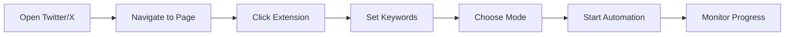

<div align="center">

# 🐦 Xmator

### Smart Twitter Automation Tool

*Intelligently manage your Twitter network with bio-based keyword filtering*

[](https://github.com/chukwunonsoprosper/Xmator)
[](LICENSE)
[](https://chrome.google.com/webstore)

---

</div>

## ✨ Features

<table>
<tr>
<td width="50%">

### 🎯 **Smart Analysis**
- Advanced bio text extraction
- Multiple detection algorithms
- Keyword-based filtering
- Duplicate prevention

</td>
<td width="50%">

### ⚡ **High Performance**
- Unlimited processing capability
- Optimized timing algorithms
- Real-time feedback
- Comprehensive logging

</td>
</tr>
<tr>
<td width="50%">

### 🛠️ **Easy to Use**
- Clean, intuitive interface
- Two automation modes
- Bulk processing support
- Professional design

</td>
<td width="50%">

### 🔧 **Platform Support**
- Works on twitter.com
- Compatible with x.com
- Chrome extension format
- Cross-platform ready

</td>
</tr>
</table>

## 🚀 Quick Start

### Installation

**Option 1: Direct Download**
```bash
# Download and extract the latest release
# Then load in Chrome Extensions (Developer Mode)
```

**Option 2: Clone Repository**
```bash
git clone https://github.com/chukwunonsoprosper/Xmator.git
cd Xmator
```

### Setup Steps
1. Open Chrome → `chrome://extensions/`
2. Enable **Developer mode**
3. Click **Load unpacked** → Select Xmator folder
4. Extension ready! 🎉

## 📋 How It Works

<div align="center">

| Mode | Action | With Keywords | Without Keywords |
|------|--------|---------------|------------------|
| **Unfollow** | Analyzes following list | Keeps matching bios | Unfollows all accounts |
| **Follow** | Analyzes suggested accounts | Follows matching bios | Follows all accounts |

</div>

### Unfollow Mode *(Default)*
```
✅ Keeps: Accounts with matching keywords in bio
❌ Unfollows: Accounts without matching keywords
🔄 Bulk Mode: Leave keywords empty to unfollow all
```

### Follow Mode
```
✅ Follows: Accounts with matching keywords in bio  
⏭️ Skips: Accounts without matching keywords
🔄 Bulk Mode: Leave keywords empty to follow all
```

## 📖 Usage Guide

### Step-by-Step Instructions

<div align="center">



</div>

| Step | Action | Details |
|------|--------|---------|
| **1** | **Navigate** | Open `twitter.com` or `x.com` |
| **2** | **Choose Page** | Following page (unfollow) or target user's following (follow) |
| **3** | **Open Extension** | Click Xmator icon in browser toolbar |
| **4** | **Set Keywords** | Enter keywords or leave empty for bulk processing |
| **5** | **Select Mode** | Choose Follow or Unfollow mode |
| **6** | **Start** | Click "Start Xmator" button |
| **7** | **Monitor** | Check browser console (F12) for real-time progress |

## 💡 Use Cases

<details>
<summary><b>🧹 Clean Your Following List</b></summary>

**Goal**: Remove accounts that don't match your interests
- **Mode**: Unfollow
- **Keywords**: `"developer, tech, startup, AI"`
- **Result**: Keeps tech-related accounts, removes others

</details>

<details>
<summary><b>🎯 Build Targeted Network</b></summary>

**Goal**: Follow accounts in your field
- **Mode**: Follow  
- **Keywords**: `"software engineer, web3, blockchain"`
- **Result**: Follows only accounts matching your criteria

</details>

<details>
<summary><b>⚡ Bulk Operations</b></summary>

**Goal**: Mass follow/unfollow without filtering
- **Mode**: Follow or Unfollow
- **Keywords**: *Leave empty*
- **Result**: Processes all available accounts

</details>

## 🛡️ Safety & Performance

<div align="center">

| Feature | Description | Benefit |
|---------|-------------|---------|
| **🔄 Smart Delays** | Random delays between actions | Natural, human-like behavior |
| **🚫 Duplicate Prevention** | Tracks processed profiles | Avoids repeated actions |
| **⚡ Unlimited Processing** | No artificial action limits | Handle large-scale operations |
| **🔍 Detailed Logging** | Comprehensive console output | Full transparency and debugging |
| **⚠️ Error Handling** | Robust error management | Continues operation despite issues |

</div>

## ⚙️ Advanced Configuration

### Keyword Strategy Tips

<table>
<tr>
<td width="50%">

**✅ Best Practices**
- Use specific, relevant terms
- Combine broad + specific keywords
- Consider synonyms and variations
- Test with small lists first

</td>
<td width="50%">

**❌ Avoid**
- Too generic keywords
- Special characters
- Very long keyword lists
- Offensive or spam terms

</td>
</tr>
</table>

**Example Keyword Combinations:**
```
🧑‍💻 Tech: "developer, engineer, programming, coding"
🚀 Startup: "founder, entrepreneur, startup, business"
🎨 Design: "designer, UI, UX, creative, artist"
📈 Marketing: "marketing, growth, SEO, content"
```

## 🐛 Troubleshooting

<details>
<summary><b>Common Issues & Solutions</b></summary>

| Issue | Solution |
|-------|----------|
| **No buttons found** | Scroll down to load more profiles |
| **Keywords not working** | Check spelling, use lowercase |
| **Extension not starting** | Ensure you're on twitter.com or x.com |
| **Actions not happening** | Check browser console (F12) for errors |

</details>

### Debug Mode
Press `F12` to open browser console for detailed logging:
- ✅ Profile analysis results
- 🔍 Keyword matching status  
- ⚡ Action confirmations
- ❌ Error messages and troubleshooting

## 🤝 Contributing

<div align="center">

**We welcome contributions!** 

[](https://github.com/chukwunonsoprosper/Xmator/fork)
[](https://github.com/chukwunonsoprosper/Xmator/issues)
[](https://github.com/chukwunonsoprosper/Xmator/pulls)

</div>

### Development Setup
```bash
# 1. Fork the repository
# 2. Clone your fork
git clone https://github.com/yourusername/Xmator.git
cd Xmator

# 3. Make changes and test
# 4. Submit pull request
```

### Guidelines
- Follow existing code style
- Add comprehensive comments
- Test on both twitter.com and x.com
- Update documentation for new features

## 📊 Version History

<details>
<summary><b>Release Notes</b></summary>

### v2.0 *(Current)*
- ✨ Complete codebase refactoring
- 🚀 Unlimited processing capabilities  
- 🧠 Enhanced bio detection algorithms
- 📝 Professional documentation
- 🔄 Bulk processing support
- 🎨 Improved UI/UX

### v1.x
- 🎯 Basic follow/unfollow automation
- 🔍 Simple keyword matching
- 🌐 Initial Chrome extension

</details>

## 🛡️ Safety Features

- **Session Limits**: Maximum 50 actions per session to prevent abuse
- **Smart Delays**: Random delays between actions (2-4 seconds)
- **Duplicate Prevention**: Tracks processed profiles to avoid repeated actions
- **Error Handling**: Robust error handling with detailed logging
- **Rate Limiting**: Built-in protections against excessive automation

## � Advanced Configuration

### Keyword Strategy Tips
- Use specific, relevant keywords for better targeting
- Combine broad and specific terms (e.g., "developer, react, javascript")
- Consider synonyms and variations of your interests
- Test with a few keywords first, then expand

### Best Practices
- Start with conservative keyword lists
- Monitor the console output to understand what's happening
- Use shorter sessions (let it run for 10-15 minutes, then pause)
- Regularly review and update your keywords

## 🐛 Troubleshooting

### Common Issues
- **No buttons found**: Scroll down the page to load more profiles
- **Keywords not working**: Check spelling and use lowercase
- **Extension not starting**: Ensure you're on twitter.com or x.com
- **Actions not happening**: Check browser console for error messages

### Debug Mode
Open browser console (F12) to see detailed logging:
- Profile analysis results
- Keyword matching status
- Action confirmations
- Error messages

## 📞 Support & Links

<div align="center">

[](https://github.com/chukwunonsoprosper/Xmator)
[](https://github.com/chukwunonsoprosper/Xmator/issues)
[](https://twitter.com/prospercode)

</div>

## 📜 License

This project is open source and available under the [MIT License](LICENSE).

---

<div align="center">

**⚠️ Important Disclaimer**

*Use Xmator responsibly and in compliance with Twitter's Terms of Service. This tool is designed for legitimate network management and should be used thoughtfully to maintain a positive experience for all users.*

**Made with ❤️ by the Xmator Team**

</div>